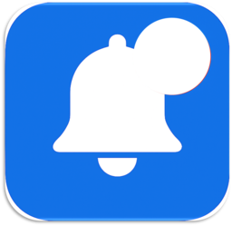
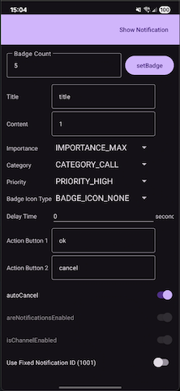

# MyNotification



## Overview
MyNotification is an Android project designed to be a comprehensive tool for testing and demonstrating the capabilities of the Android Notification system. It allows developers to customize and trigger various types of notifications to see how they behave on different devices and Android versions.

## Features
- **Full Notification Customization**:
  - Set custom title and content.
  - Adjust notification **Importance** (`NotificationManager.IMPORTANCE_*`).
  - Assign a **Category** (e.g., `CATEGORY_EVENT`, `CATEGORY_MESSAGE`).
  - Set **Priority** for older Android versions.
  - Configure **Badge Icon Type**.
- **Delayed Notifications**: Schedule a notification to appear after a specified delay, with a visible countdown timer on the screen.
- **Action Buttons**: Add up to two custom action buttons to the notification.
- **App Icon Badge Count**:
  - Set a specific number for the app icon's badge.
  - Includes a compatibility library (`NotificationBadge`) to support various launchers (Samsung, Sony, Xiaomi, etc.).
  - Provides UI feedback on whether setting the badge was successful.
- **Notification ID Control**:
  - Switch between a fixed notification ID (for updating existing notifications) and a random ID (for creating new ones).
- **UI & State Management**:
  - All settings are saved and restored on app launch using `SharedPreferences`.
  - The UI is built with `ViewBinding` and utilizes a `ScrollView` to fit all options on screen.
  - A `ViewModel` is used to manage UI state and business logic.
  - Displays the current notification permission status (both app-level and channel-level).

## Prerequisites
- Android Studio (latest version recommended)
- Minimum SDK version: 21 (Android 5.0 Lollipop)
- Target SDK version: 33 (Android 13)

## Setup Instructions
1. Clone the repository:
   ```bash
   git clone https://github.com/yourusername/MyNotification.git
   ```
2. Open the project in Android Studio.
3. Sync the Gradle files.
4. Build and run the project on an emulator or physical device.

## Usage
1. Launch the app on your Android device.
2. Adjust the various settings in the UI to configure the notification.
3. Click the **"Show"** button to trigger the notification with the specified delay.
4. Use the **"setBadge"** feature to test the app icon badge functionality on your device's launcher.

