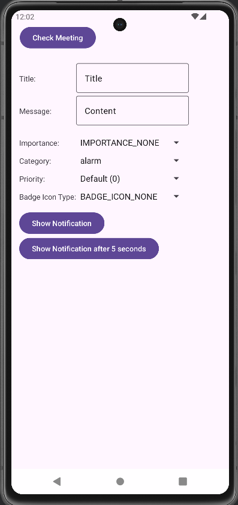

# MyNotification



## Overview
MyNotification is an Android project designed to demonstrate how to implement and customize notifications in an Android application. It provides examples of basic notifications, action buttons, and custom layouts.

## Features
- Basic notifications
- Notifications with action buttons
- Custom notification layouts
- Notification channels for Android 8.0+ (Oreo)

## Prerequisites
- Android Studio installed
- Minimum SDK version: 21 (Android 5.0 Lollipop)
- Target SDK version: 33 (Android 13)

## Setup Instructions
1. Clone the repository:
   ```bash
   git clone https://github.com/yourusername/MyNotification.git
   ```
2. Open the project in Android Studio.
3. Sync the Gradle files.
4. Build and run the project on an emulator or physical device.

## Usage
1. Launch the app on your Android device.
2. Use the provided UI to trigger different types of notifications.
3. Customize the notification content and behavior in the source code as needed.
